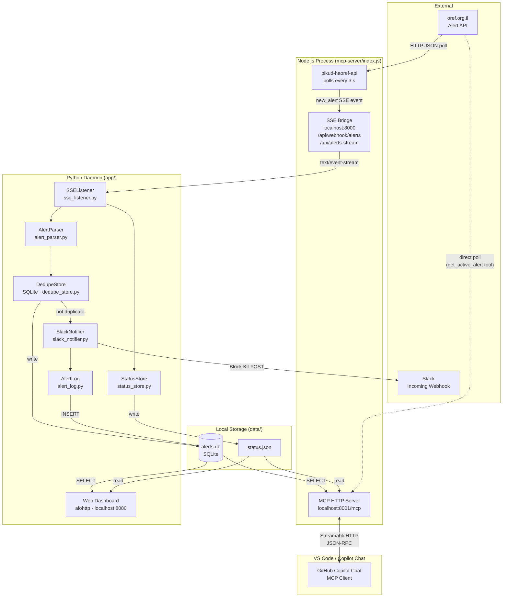

# Architecture

> The alert feed is powered by [Leon Melamud's `pikud-a-oref-mcp`](https://github.com/LeonMelamud/pikud-a-oref-mcp).
> This project wraps it with a local SSE bridge, a Python Slack-forwarding daemon, and a web dashboard.

